Rolling 12 months log created with tibber_easee_peak_power_analyzer.py
for a freestanding house with 5 occupants outside Gothenburg (without PV installed).
Household that optimizes pure electric hot water heating using vvb_optimizer_connected.py,
and reverse cycle heating optimization controlled by sensibo_optimizer.py
Peak power usage is managed by tibber_power_monitor.py
Data collection with EV charging excluded (since easy to move in time and restrict peak power)

Data logging and saving calculations at https://github.com/sander-visser/py-playground/blob/main/tibber_easee_peak_power_analyzer.log

---
One year ago:
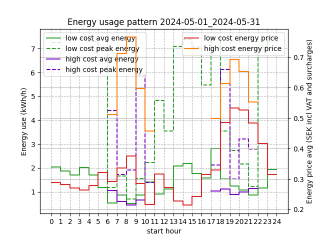

---

Last 12 months
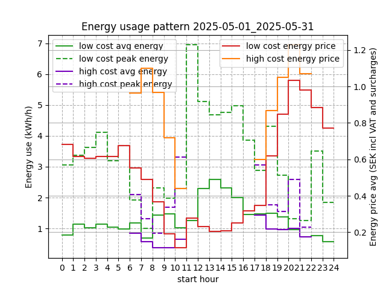
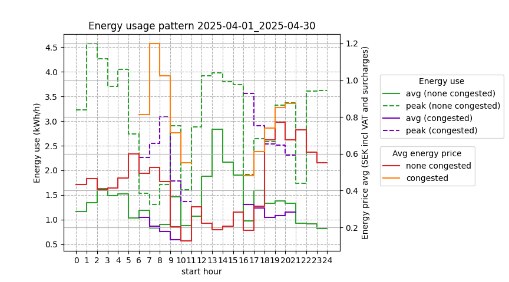
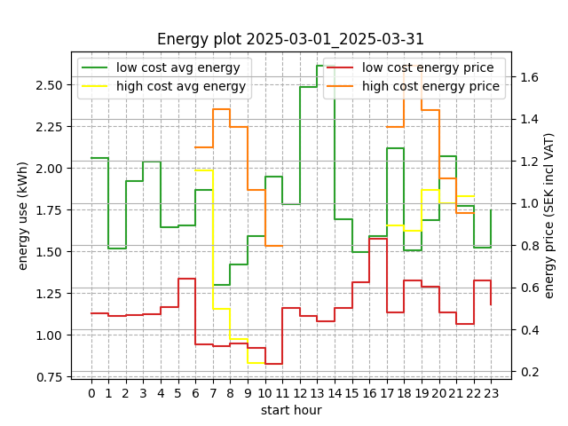
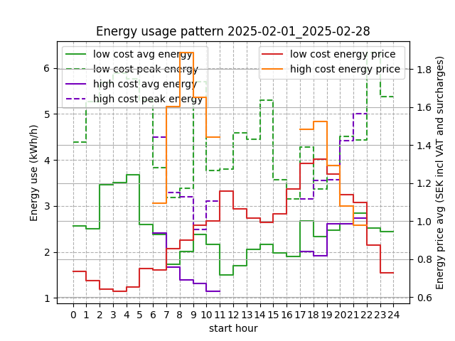
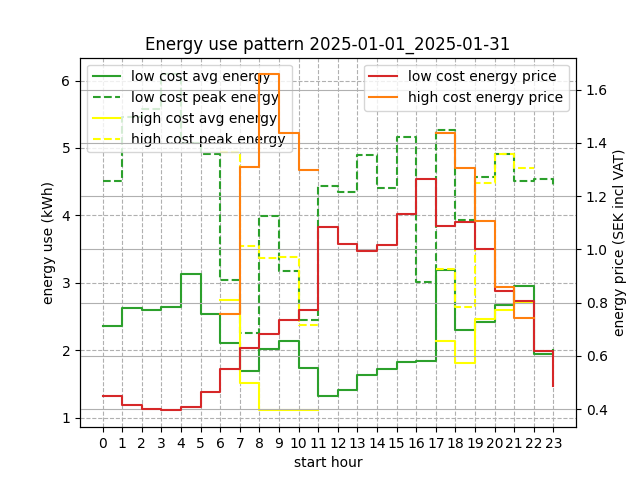
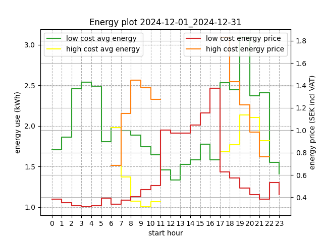
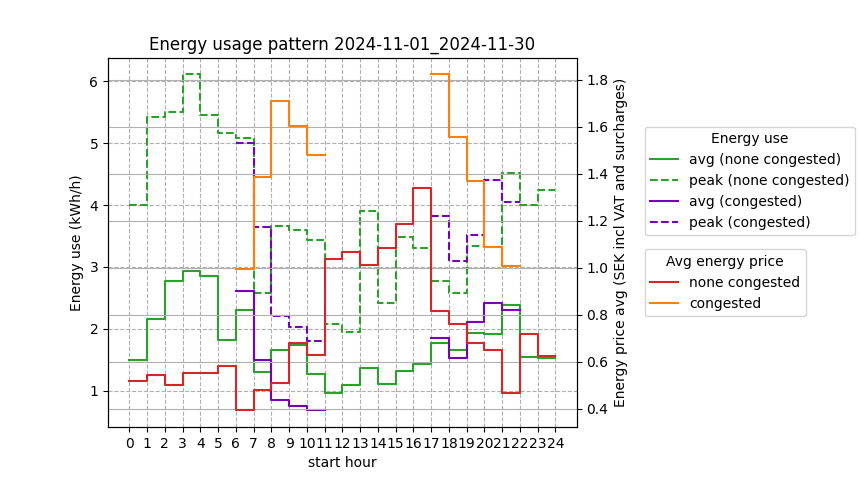
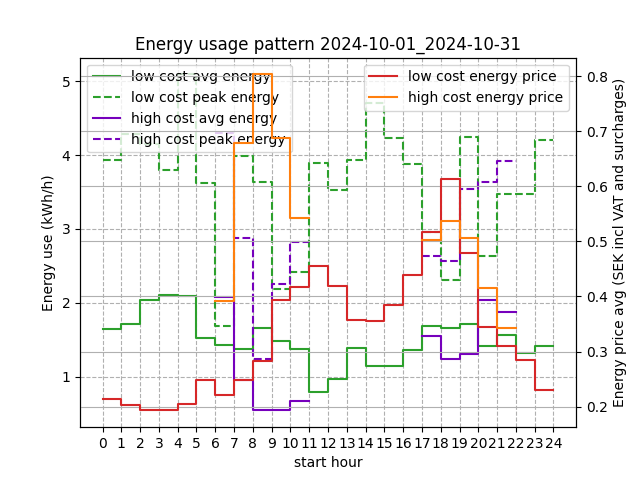
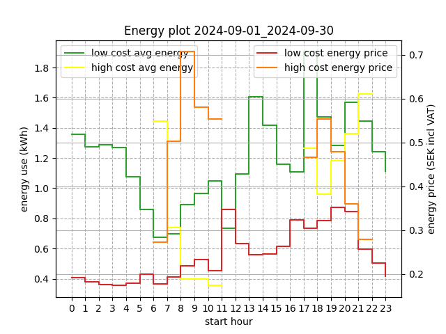
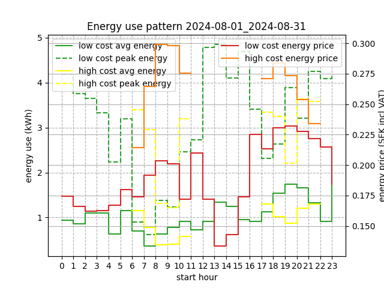
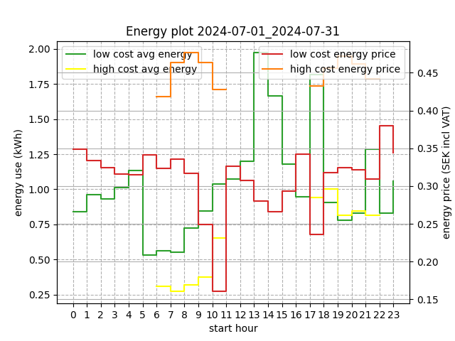
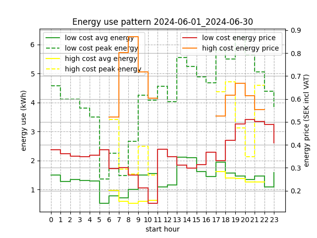
