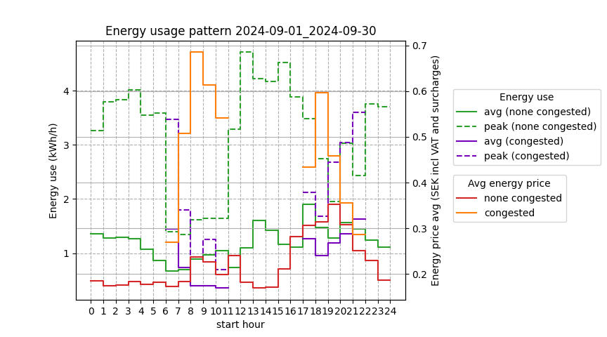
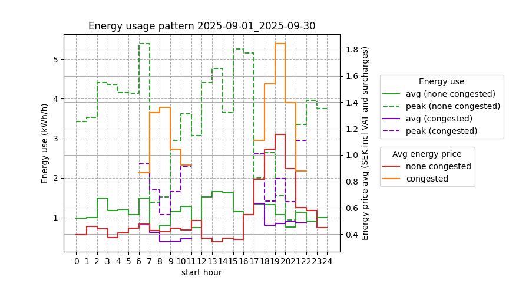
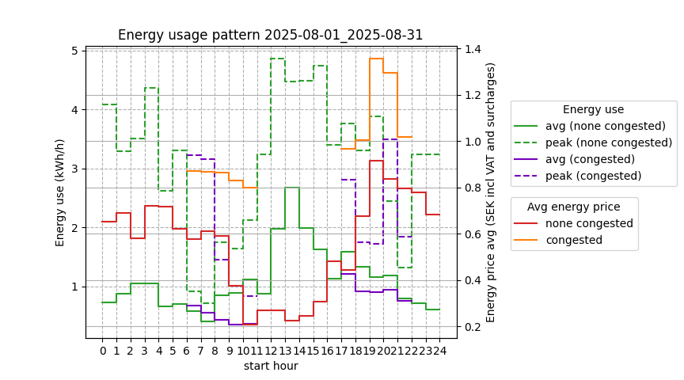
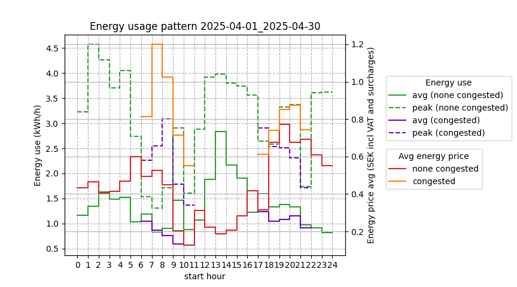
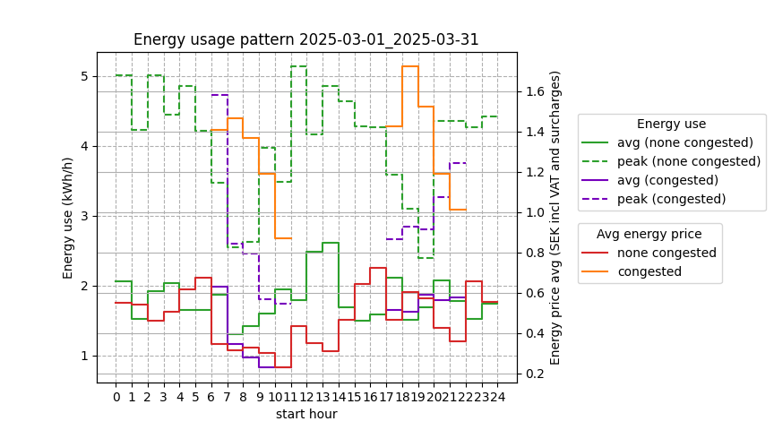
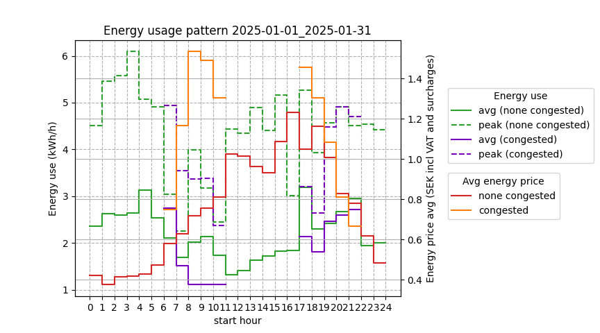

# Rolling 12 months energy plot created with tibber_easee_peak_power_analyzer.py
For a freestanding house with 5 occupants outside Gothenburg (without PV installed).
Household that optimizes pure electric hot water heating using vvb_optimizer_connected.py,
and reverse cycle heating optimization controlled by sensibo_optimizer.py in SE3.
Peak power usage is managed by tibber_power_monitor.py
Data is collected with EV charging excluded (as EVs can be planned and control peak power).

## Raw data logging and saving calculations at
https://github.com/sander-visser/py-playground/blob/main/tibber_easee_peak_power_analyzer.log
This log includes estimated benefit from future PV and home battery storage installation.

---
### One year ago

---

### Last 12 months

